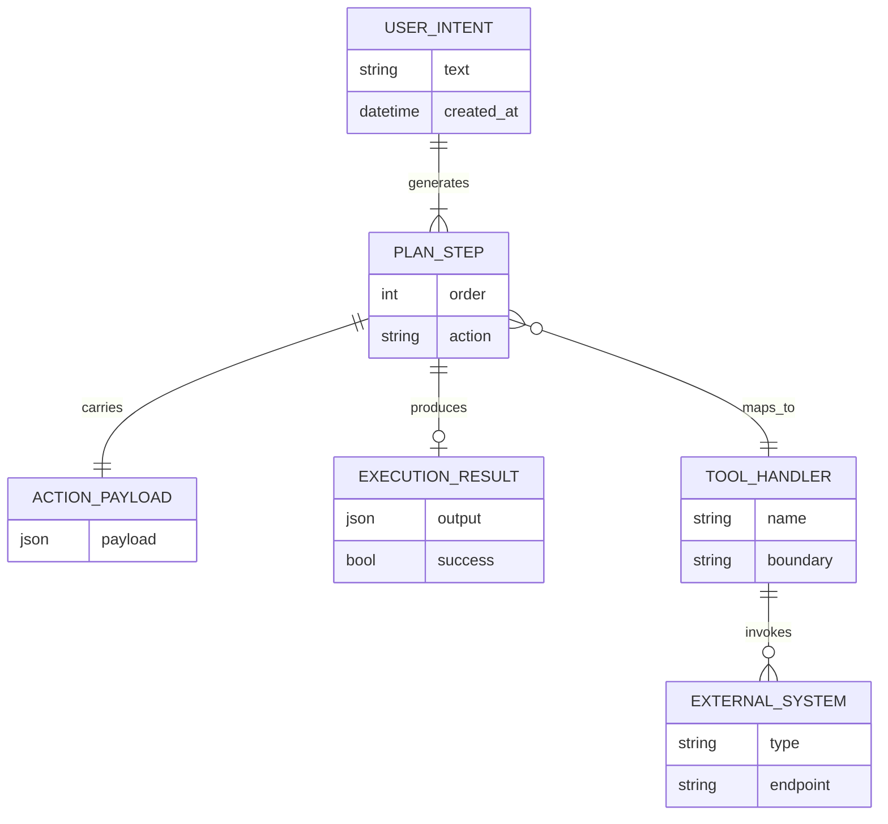
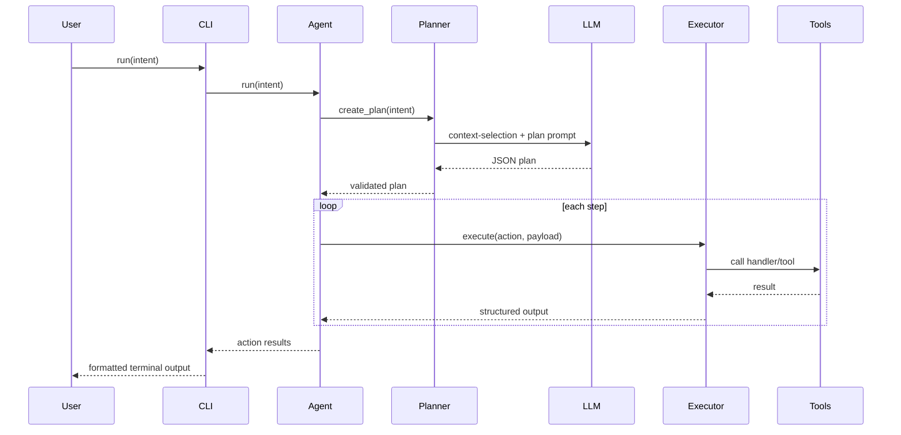

# DevmateAI Interview Preparation Guide

## 1) Project Idea, Purpose, Differentiation, Problem Statement, and Engineering Challenges

### Elevator pitch (30 seconds)
DevmateAI is an autonomous developer CLI agent that takes natural-language intent and converts it into a **validated, constrained execution plan** before performing any action. Instead of letting an LLM execute arbitrary shell commands, it uses a strict planner + deterministic executor architecture to keep behavior controllable and testable.

### Problem it solves
Developers often lose time on repetitive repo tasks:
- finding relevant files,
- editing boilerplate,
- checking git status/diff,
- reading PR comments,
- applying routine fixes.

DevmateAI addresses this by converting high-level intent into explicit machine actions and executing them through allow-listed handlers.

### Why this is different from typical chat assistants
Most chat assistants are prompt-first and tool-second; DevmateAI is **plan-first and execution-bounded**:
1. It generates JSON-only plans with allowed actions.
2. It validates each step before execution.
3. It runs side effects only through the executor’s known handlers.
4. It supports repo-aware context selection before planning.

### Real-world value proposition
- Safer automation for internal engineering workflows.
- Repeatable behavior under tests and mocks.
- Better auditability: action-by-action results are returned.

### Challenges faced (and how to explain them in interview)
1. **LLM output reliability**
   - Challenge: model may return non-JSON or unsupported actions.
   - Solution: strict JSON prompt contract + parser + plan validation layer.

2. **Context overload vs context starvation**
   - Challenge: giving the entire repo to the model is expensive and noisy.
   - Solution: RAG-lite context builder with file selection and truncation limits.

3. **Safety of side effects**
   - Challenge: autonomous tools can become risky quickly.
   - Solution: deterministic executor with explicit action handlers only (no free-form shell execution path).

4. **Testability of AI systems**
   - Challenge: non-deterministic LLM behavior makes tests flaky.
   - Solution: mock LLM/tool layers in unit tests and validate planner/executor contracts independently.

---

## 2) Tech Stack, Why This Stack, Why Not Alternatives, and Future Integrations

### Current stack
- **Language**: Python 3.10+
- **CLI framework**: Typer
- **Terminal output**: Rich
- **LLM**: OpenAI Chat Completions via `openai` SDK
- **Version control integration**: native Git CLI calls
- **GitHub integration**: PyGithub
- **Config management**: python-dotenv + settings object
- **Testing**: unittest + unittest.mock

### Why this stack
- Python is ideal for rapid automation and API orchestration.
- Typer gives production-quality CLI ergonomics with low ceremony.
- Rich improves UX for command-line users.
- OpenAI SDK and PyGithub are mature and easy to mock.
- `unittest.mock` is sufficient for isolated contract tests of planner/executor/tool boundaries.

### Why not other frameworks (strong interview framing)
- **Not LangChain / heavy orchestration frameworks** (initially):
  - The project emphasizes explicit control and minimal abstractions.
  - Easier to reason about plan validation and execution safety in custom lightweight architecture.

- **Not agentic shell-first frameworks**:
  - Shell-first approaches can be flexible but higher risk.
  - This design intentionally favors bounded actions over unlimited power.

- **Not full web app framework**:
  - Product is CLI-first; terminal-native flow is the core UX.
  - Can later add a web dashboard without replacing core engine.

### What can be integrated next
1. **Patch/diff-based editing** instead of whole-file overwrite.
2. **Approval gates** for destructive or high-impact actions.
3. **Test-aware loop** (edit → run tests → fix failures automatically).
4. **Multi-LLM routing** (small model for planning, stronger model for code-fix).
5. **Vector store memory** for long-running repo knowledge.
6. **CI/CD connectors** (GitHub Actions, Jira, Slack, Linear).
7. **Policy engine** (team-level guardrails and role-based permissions).

---

## 3) ER Diagram, Entities, LLD, Object Relationships, User Flow, App + Tech Workflow

> Note: DevmateAI is not a database-centric app today. The “ER diagram” below models runtime domain entities and their relationships.

### Domain ER-style model (conceptual)

### Core entities in code
- `Agent`: orchestrates planning and execution.
- `Planner`: converts intent to validated JSON plan.
- `RepoContextBuilder`: chooses and reads relevant file context.
- `Executor`: routes action names to internal handlers.
- Tool modules:
  - `filesystem` for read/write/list,
  - `git` for status/diff/commit,
  - `github` for PR APIs.
- `CodeFixer`: LLM-based modifier for PR review autofix flow.

### Low-level design (LLD)

#### 1. CLI Layer
- Accepts intent from user command.
- Initializes agent and prints step-wise results.

#### 2. Orchestration Layer (`Agent`)
- Calls planner to create plan.
- Iterates through plan steps.
- Executes each action via executor.
- Handles PR review autofix special case.
- Aggregates results for final CLI output.

#### 3. Planning Layer (`Planner`)
- Selects relevant repository files through context-selection prompt.
- Reads file snippets via `RepoContextBuilder`.
- Builds full planning prompt including context.
- Calls LLM and parses JSON.
- Validates each step against allow-list and payload shape.

#### 4. Execution Layer (`Executor`)
- Performs dynamic dispatch to `_handle_<action>` methods.
- Enforces handler existence and payload checks.
- Delegates side effects to tools only.

#### 5. Tools Layer
- Filesystem: pure file operations.
- Git: subprocess wrappers with captured output.
- GitHub: API wrappers with token-gated client.

#### 6. Infrastructure
- Settings: `.env` loading and key validation.
- LLM client: centralized model calls.
- Logger: centralized structured logging.

### Object relationships
- `CLI.run()` → `Agent.run(intent)`
- `Agent` has `Planner` + `Executor`
- `Planner` has `LLMClient` + uses `RepoContextBuilder`
- `Executor` uses tool modules (`filesystem`, `git`, `github`)
- `CodeFixer` has its own `LLMClient` for patch generation

### User flow (functional)
1. User runs: `python -m devmate run "<intent>"`
2. CLI forwards intent to agent.
3. Planner generates and validates action plan.
4. Executor runs each step deterministically.
5. Results are printed back to user.

### Technical workflow (runtime sequence)

---

## 4) Interview Counter Questions + Strong Model Answers

### Product and strategy
1. **Q: Why build this as CLI-first instead of web-first?**
   - A: Target users are developers already in terminal workflows. CLI reduces friction, improves speed, and allows composability with git/tooling. Web can be a later visualization layer.

2. **Q: What is your core moat?**
   - A: Safe autonomous workflow design: strict plan validation + deterministic executor + testability. Many tools can generate code; fewer can execute autonomous changes with bounded risk.

3. **Q: How do you measure success?**
   - A: Task completion rate, average time saved per intent, failed plan rate, unsafe-plan rejection rate, and post-change rollback frequency.

### Architecture and safety
4. **Q: How do you prevent prompt injection or unsafe operations?**
   - A: Limit capability at executor boundary (allow-listed actions), validate all steps before execution, and avoid arbitrary shell/tool access. Even if prompt is malicious, unsupported actions are rejected.

5. **Q: What happens if model returns malformed output?**
   - A: Planner JSON parse fails and raises validation error; execution doesn’t proceed.

6. **Q: Why separate planner and executor?**
   - A: Clear separation of concerns: planner handles reasoning; executor handles side effects. This improves safety, testability, and extensibility.

### LLM and performance
7. **Q: How do you control token costs?**
   - A: RAG-lite file selection, max file size caps, max file count caps, and single-purpose prompts.

8. **Q: Why use one model for planning and fixing?**
   - A: Simplicity for MVP. Future optimization can use smaller/faster planning model and stronger code-edit model.

9. **Q: How do you handle hallucinations?**
   - A: Constrain output format, action allow-list, and deterministic execution. The model can suggest, but executor decides what is possible.

### Testing and reliability
10. **Q: How do you test AI-heavy flows reliably?**
    - A: Mock LLM responses and external APIs; test planner validation, executor dispatch, and orchestration paths independently.

11. **Q: What failure scenarios did you design for?**
    - A: Invalid JSON from LLM, unknown actions, missing payload fields, missing tokens/keys, git command failures.

12. **Q: How would you productionize this?**
    - A: Add telemetry, retries/backoff, action-level approvals, sandboxing policies, idempotency checks, and richer integration tests in CI.

### System design deep-dive
13. **Q: If this scales to teams, what changes?**
    - A: Multi-tenant policy engine, RBAC, audit logs, centralized run history, approval workflows, and organization-level tool plugins.

14. **Q: If you needed near-real-time collaboration?**
    - A: Introduce event bus + state store, run queue, and web dashboard for plan preview/approval/execution tracking.

15. **Q: How would you support custom enterprise tools?**
    - A: Tool plugin interface with typed schemas and standardized executor contract, plus policy checks before invocation.

---

## Quick Interview Cheat Sheet

### One-liner
“DevmateAI is a safety-first autonomous developer CLI that translates natural language into validated action plans and executes them deterministically over repo, git, and GitHub operations.”

### 60-second architecture summary
- CLI receives intent.
- Planner (LLM + context) generates strict JSON plan.
- Validator rejects unknown actions.
- Executor dispatches allow-listed handlers.
- Tools perform controlled side effects.
- Results are returned step-by-step.

### Three strongest design decisions
1. Planner/executor separation.
2. Allow-listed deterministic execution.
3. Mock-heavy test strategy for reliability.

